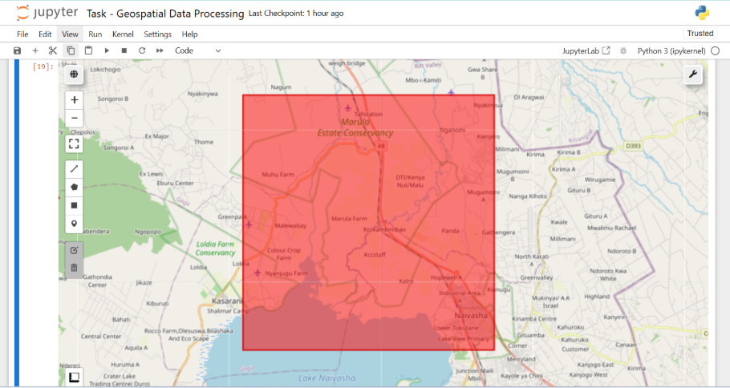
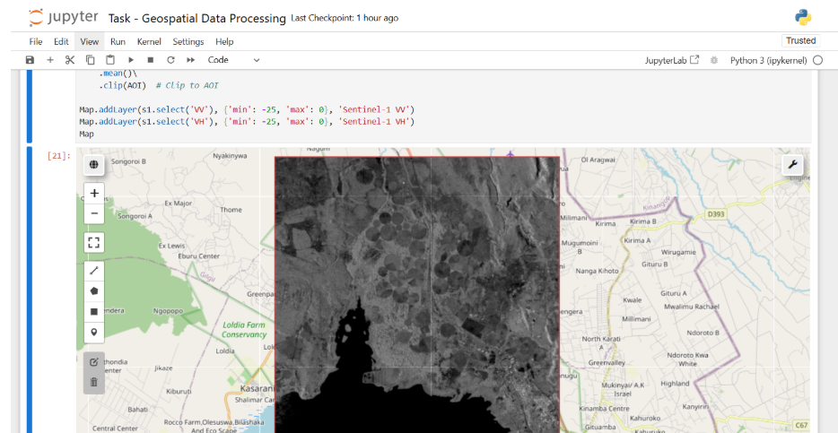
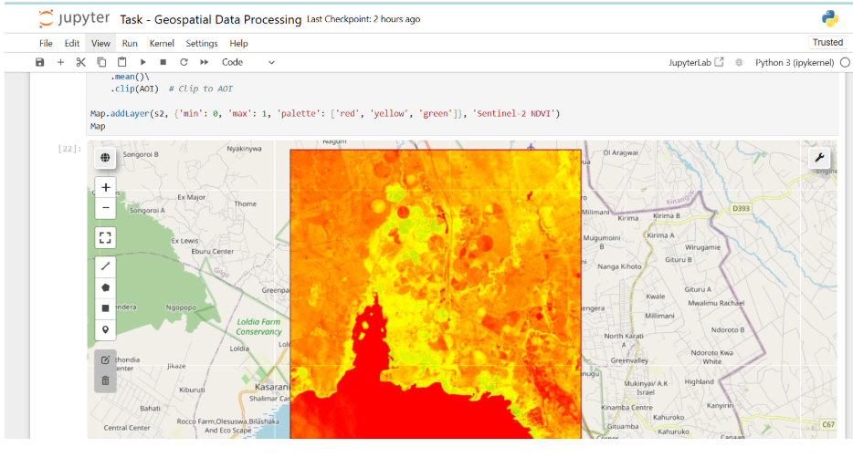
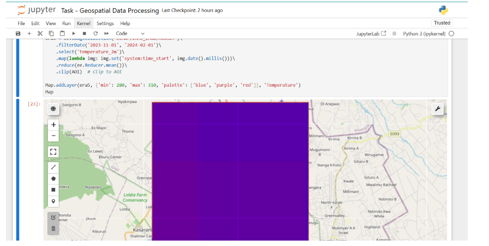
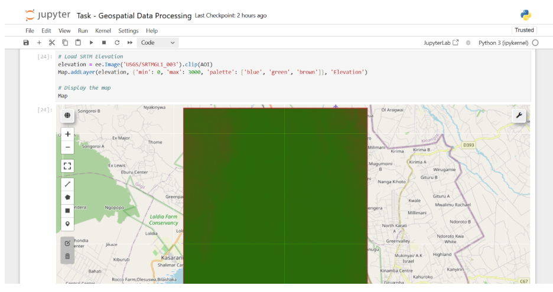
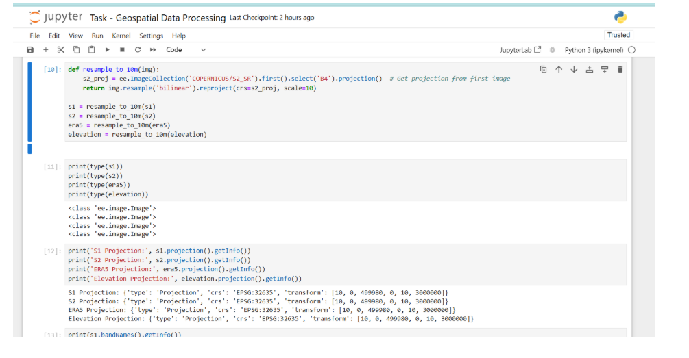
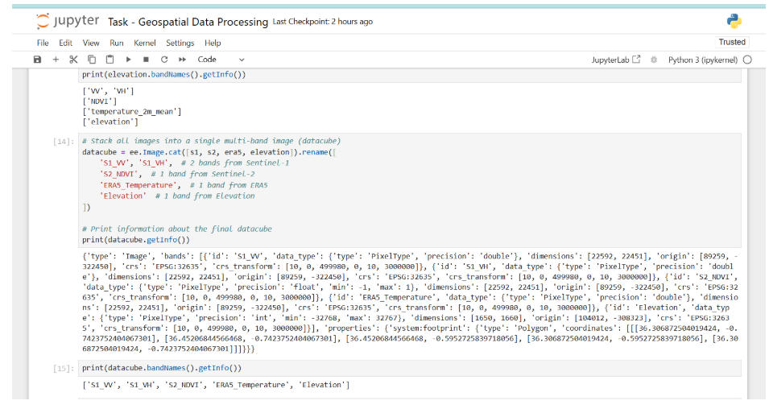
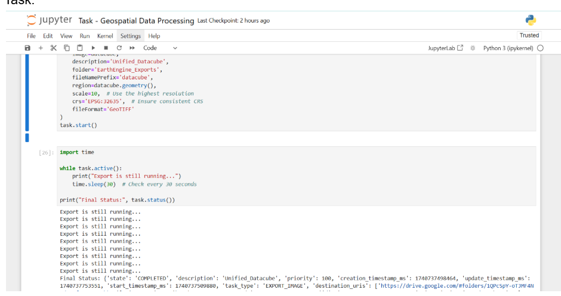

# Datacube Processing Project  AMINI

This project involves using Google Earth Engine. Fetching the datasets - Sentinel 1 , Sentinel 2 , Temperature and Elevaton , Visualising each dataset on a map, doing resampling the finally processing them into a geospatial datacube.

## 🚀 Deliverables
1. **Jupyter Notebook** for processing and visualization.
2. **Final Datacube File**: [Download Here](https://drive.google.com/file/d/1RxXBi--KGgUYbeWZWKpa9J-LaXF6tElF/view?usp=sharing)  
*(File is large, hosted on Google Drive)*

## 📂 Files in Repository
- `Task  - Geospatial Data Processing.ipynb` - Main notebook with notebook
- `requirements.txt` - Dependencies


## 📸 Screenshots  

### 📍 AOI  
  

### 🛰️ Sentinel 1  
  

### 🛰️ Sentinel 2  
  

### 🌡️ Temperature  
  

### 🏔️ Elevation  
  

### 📉 Resampling  
  

### 🗂️ Combined Datacube Band Names  
  

### ✅ Task  
  


## 📥 Installation
```bash
git clone https://github.com/KimutaiLawrence/geospatial-data-processing.git
cd AMINI
